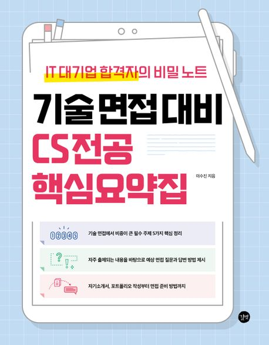

# CS_study
기술 면접 대비 CS 전공 핵심 요약집(이수진) 리뷰 스터디

## 교재
https://product.kyobobook.co.kr/detail/S000208504237

## 인원
|이름|블로그|github|
|-|-|-|
|강감찬|[velog](https://velog.io/@gsgh3016)|[github](https://github.com/gsgh3016)|
||||
||||

## 규칙

## 참고사항
- 이 레포지토리를 fork해서 사용하세요.
- PR 및 commit시 [commit message convention](https://www.conventionalcommits.org/en/v1.0.0/)을 지켜주세요.
- 개인 폴더를 소문자 영어 이름으로 만들어주세요.
- 각자 언어에 따라 .gitignore를 업데이트 해주세요.